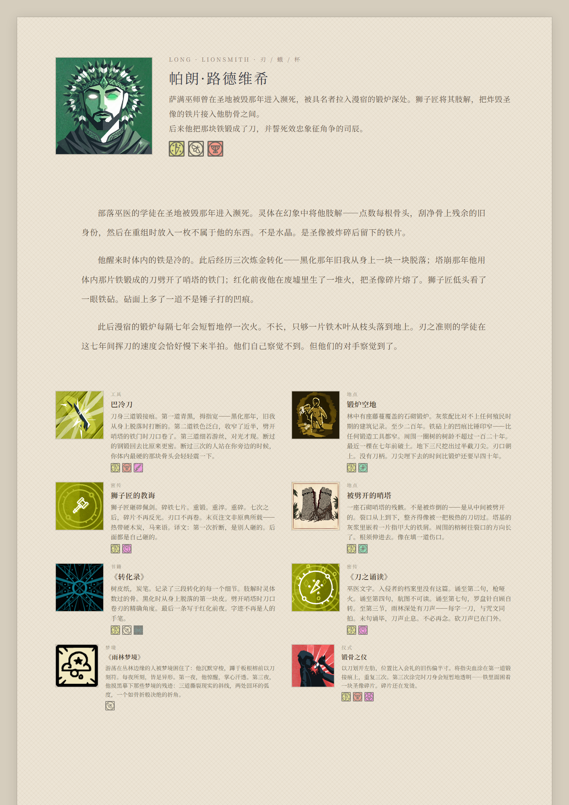
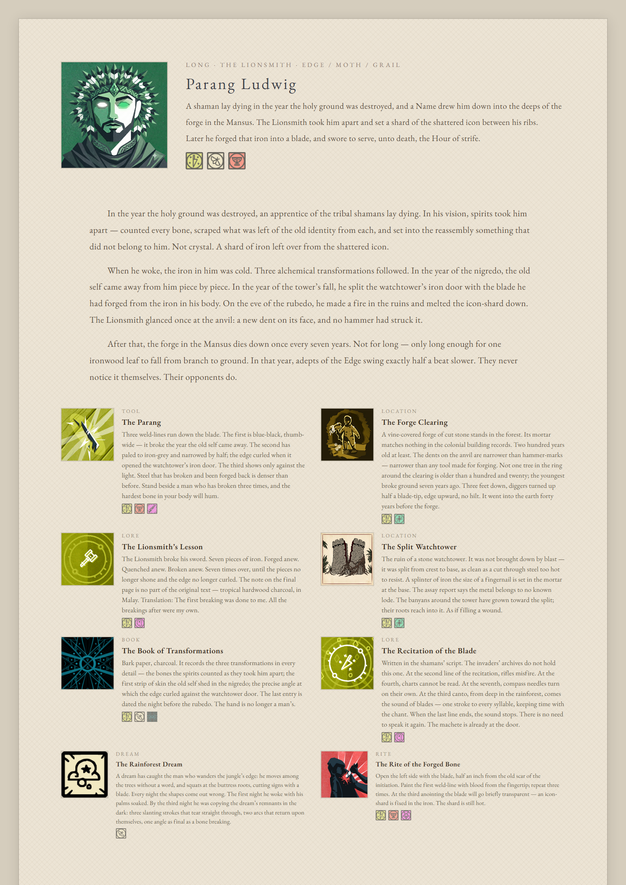

# Cultist Simulator Text Tools

A toolkit for writing Cultist Simulator original characters in the game's actual prose style — by rules, not by feel. The [style guide](prompts/cs-writing-guide.md) was distilled statistically from 1,950 lines of game text; every card is validated against 2,146 real game records; the finished character is assembled into a printable A4 sheet.

## Example: Parang Ludwig

A Long of Edge/Moth/Grail, ascended through the Lionsmith. Once an apprentice of the tribal shamans: the year the colonists destroyed the shrine, spirits dismembered him in a dying vision — and the reassembly left a shard of the shattered icon inside him.

| 中文页 | English page |
|--------|--------------|
|  |  |

Card texts: [cards.zh.md](examples/parang-ludwig/cards.zh.md) · [cards.en.md](examples/parang-ludwig/cards.en.md)

## The method: narrative constellation

Instead of writing a character profile, one character's story is split across 7–8 carrier cards of different game object types — tool, book, location, lore fragment, rumour, dream, rite — matching Cultist Simulator's own fragmented way of telling stories. Each card is about its own subject first; the character only surfaces in passing. The reader pieces the fragments back together.

The 15 carrier types and their narrators are catalogued in the [style guide](prompts/cs-writing-guide.md) (Chinese).

## Workflow

Entry point: [skill.md](skill.md). Six phases: concept → constellation planning → dual-agent writing (a Writer drafts, an Editor reviews sentence by sentence) → aspect validation with `python src/validate_aspects.py` → A4 page assembly → completeness review.

## Project structure

```
├── skill.md                    # entry point — the six-phase workflow
├── prompts/
│   ├── cs-writing-guide.md     # style guide, distilled from 1,950 lines of game text
│   ├── concept-generation.md   # character concept template
│   └── page-design.md          # A4 page design tokens
├── knowledge/
│   ├── cs-lore/                # Cultist Simulator lore: principles, Hours, hierarchy
│   ├── occult-traditions/      # real-world occult traditions, 200+ concept cards
│   └── aspect-registry.md      # mandatory aspects per item category
├── src/
│   ├── validate_aspects.py     # validates each card's aspects against game data
│   ├── review_layout.py        # screenshots the A4 page and runs a vision review
│   ├── build_raw_corpus.py     # corpus pipeline (runs on local game data)
│   └── analyze_language_dna.py # language statistics
├── examples/
│   └── parang-ludwig/          # the finished example above, Chinese and English
├── CLAUDE.md / AGENTS.md       # project conventions for coding agents
└── README.md
```

## License

MIT, covering this project's original methodology, rules and text only — no game assets.

Cultist Simulator is a game by [Weather Factory](https://weatherfactory.biz); this is an unaffiliated fan project, and the game assets visible in the example renders remain theirs.

---

# 密教模拟器文本工具

写风格纯正的《Cultist Simulator》原创角色。"风格纯正"不靠语感：[文体规则书](prompts/cs-writing-guide.md)从 1,950 条游戏原文统计蒸馏而来，每张卡对照 2,146 条真实游戏数据做[性相校验](knowledge/aspect-registry.md)，成品排成可打印的 A4 展示页。

## 示例：帕朗·路德维希（Parang Ludwig）

刃/蛾/杯长生者，经狮子匠飞升。曾是部落巫医学徒——殖民者炸毁圣地那年，他在濒死幻象中被灵体肢解，重组时体内多了一片圣像碎铁。

页面预览见上方图表；卡牌文本：[cards.zh.md](examples/parang-ludwig/cards.zh.md) · [cards.en.md](examples/parang-ludwig/cards.en.md)

## 方法：叙事星座

把一个人的设定拆分成 7–8 张不同类型的载体卡——工具、书籍、地点、密传、传闻、梦境、仪式——符合密教模拟器本身的碎片化叙事风格。每张卡先讲它自己，人物只在边缘掠过，读者自己把碎片拼回来。

15 种载体与各自的叙述者，见[文体规则书](prompts/cs-writing-guide.md) §三。

## 工作流

入口 [skill.md](skill.md)，六阶段：概念 → 星座规划 → 双 Agent 写作（Writer 初稿，Editor 逐句审校）→ 性相校验（`python src/validate_aspects.py`）→ A4 页面 → 完整性审查。

## 项目结构

```
├── skill.md                    # 六阶段工作流入口
├── prompts/
│   ├── cs-writing-guide.md     # 文体规则书（唯一文风权威，蒸馏自 1,950 条游戏原文）
│   ├── concept-generation.md   # 角色概念模板
│   └── page-design.md          # A4 页面设计令牌
├── knowledge/
│   ├── cs-lore/                # 密教知识库：准则、司辰、位阶
│   ├── occult-traditions/      # 真实神秘学传统，200+ 概念卡
│   └── aspect-registry.md      # 各类物品的强制性相注册表
├── src/
│   ├── validate_aspects.py     # 性相校验：逐卡比对游戏数据
│   ├── review_layout.py        # A4 页面截图 + 识图评审
│   ├── build_raw_corpus.py     # 语料管道（配合本地游戏数据运行）
│   └── analyze_language_dna.py # 语言统计
├── examples/
│   └── parang-ludwig/          # 上面那套成品示例（中英两版）
├── CLAUDE.md / AGENTS.md       # 编码 agent 的项目约定
└── README.md
```

## License

MIT，仅覆盖本项目原创的方法论、规则与文本，不含游戏素材。

Cultist Simulator 是 [Weather Factory](https://weatherfactory.biz) 的游戏，本项目为无隶属关系的同人项目；示例渲染图中出现的游戏素材版权归原作者所有。
